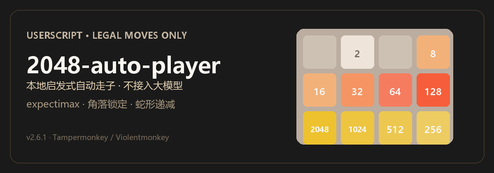

# 2048-auto-player

<p align="center">
  
</p>

在浏览器里用 **Tampermonkey / Violentmonkey** 自动玩 2048：每一步都是真正的方向滑动，分数由游戏服务端正常累计。

> 这是本地 **expectimax + 蛇形启发式** 脚本，**不接入大模型 / 云端 AI**。

## 实战结果（合法对局）

| 局 | 分数 | 最大砖 | 说明 |
|----|------|--------|------|
| 1 | 7,224 | 512 | 角锁完好，空位耗尽 |
| 2 | 35,628 | **2048** | 角锁完好，空位耗尽 |

目标站 [2048.linux.do](https://2048.linux.do/) 的历史榜只收录 **双 8192** 通关局；本脚本提高合法强度，**不保证**冲到榜一。

## 它做什么

| 会做 | 不会做 |
|------|--------|
| 调用页面正规 `handleMove` / 方向键 | 改棋盘数字、伪造分数 |
| 角锁定 + **蛇形递减**（大→小沿蛇身） | 接入 ChatGPT / 其它云端模型 |
| 惩罚「两边夹中间大」的坏形 | 破解 / 刷排行榜接口 |
| 空位少时加深搜索 | 保证双 8192 或历史 #1 |

## 怎么工作（一句话）

对每个合法方向做浅层 **expectimax**（随机刷 2/4 取期望），用评价函数偏好：**最大砖在角、沿蛇身递减、空位多、少夹心**。

理想底行（左下角策略）接近：

```text
2048 → 1024 → 512 → 256
```

而不是 `32 · 128 · 32` 这种两边夹中间大的结构。

## 安装（约 1 分钟）

1. 安装 [Tampermonkey](https://www.tampermonkey.net/)（或 Violentmonkey）
2. 新建脚本 → 粘贴 [`2048-auto-player.user.js`](./2048-auto-player.user.js) 全文 → 保存
3. 打开 https://2048.linux.do/ （需已登录）
4. 点右上角面板 **「开始」**

暂停用面板上的「暂停」。`CONFIG.autoStart` 默认为 `false`。

### 仓库布局

```text
userscripts/
  2048-auto-player/
    2048-auto-player.user.js
    README.md
    EXPERIENCE.md
    assets/readme/hero.png
    assets/readme/hero.svg
```

路径示例：`D:\workspace\XYTX\userscripts\2048-auto-player\`

## 常用配置

脚本顶部 `CONFIG` 可调。v2.6 与蛇形相关的推荐起步：

| 参数 | 推荐 | 作用 |
|------|------|------|
| `preferredCorner` | `'bl'` | 左下角锁定 |
| `snakeScale` | `≈1.4` | 大砖靠蛇头 |
| `snakeMonoWeight` | `≈220` | 蛇路径必须递减 |
| `sandwichPenalty` | `≈18000` | 惩罚夹心形 |
| `canvasThinkCrisisMs` | `≈120` | 空位少时多想一会 |
| `canvasWsSettleMs` | `≈40` | canvas/WS 步间隔 |

完整注释见脚本文件内 `CONFIG` 区块。

## 局限

- **linux.do canvas** 每步走 WebSocket：想太久会堵包，深度有上限。
- 常见死因仍是 **后期空位耗尽**（即使角锁正确）。
- 历史榜门槛是双 8192 + 高分；自动脚本只能提高概率，不能承诺上榜。

更细的对局复盘见 [EXPERIENCE.md](./EXPERIENCE.md)。

## 版本

当前 **v2.6.1**：强化蛇形递减、反夹心、次大砖贴蛇身第二格、危机盘加深；已配置 GitHub `@updateURL`。

## 友链

- [LINUX DO](https://linux.do/) — 社区与讨论
- [2048 @ LINUX DO](https://2048.linux.do/) — 本脚本主要适配的游戏页
